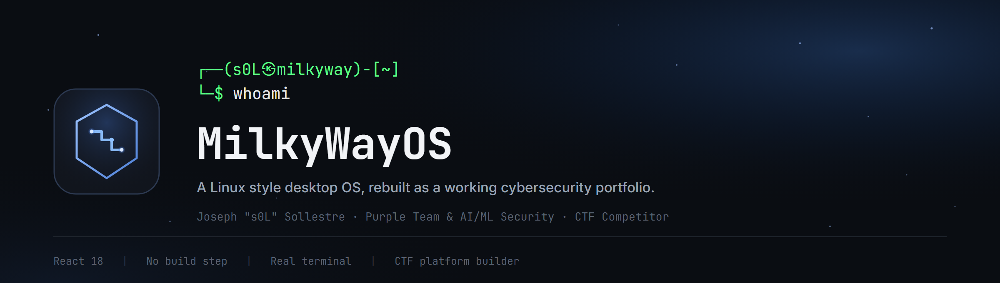
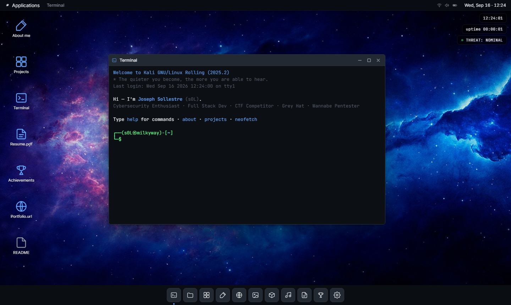
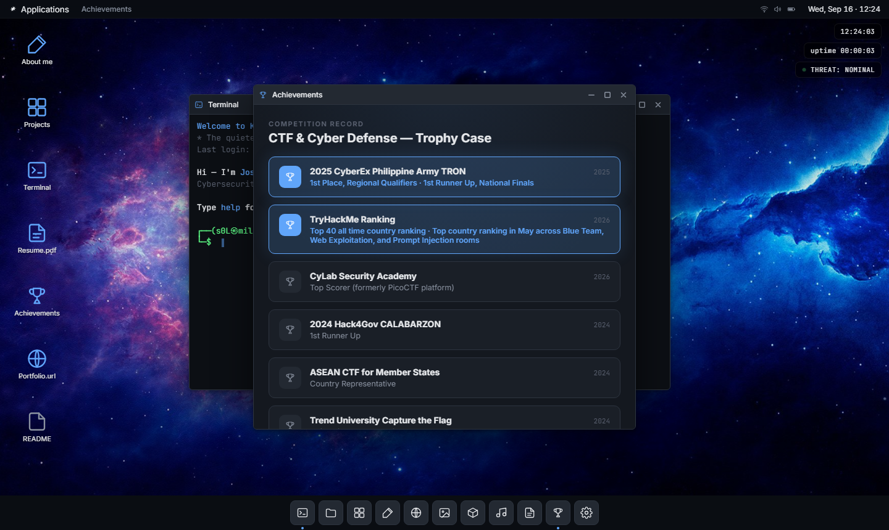
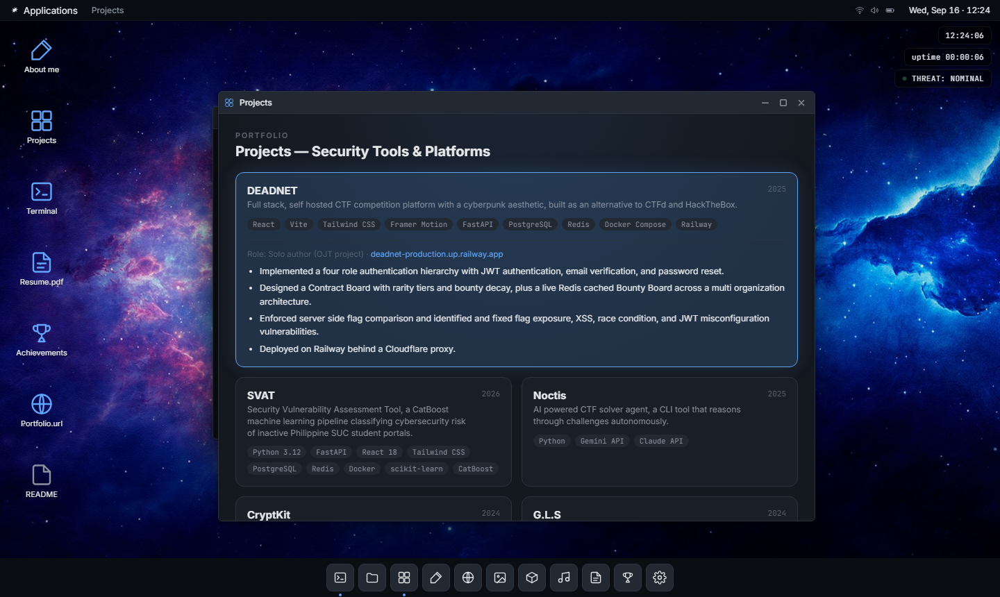
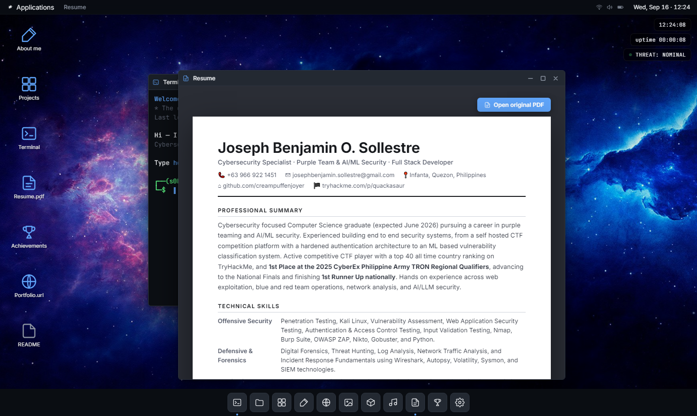
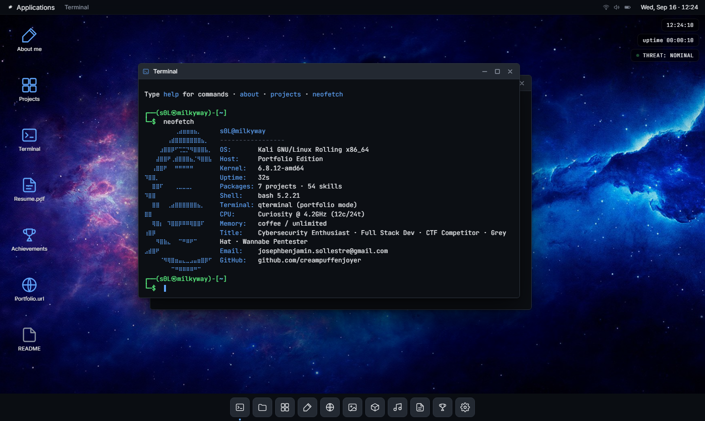
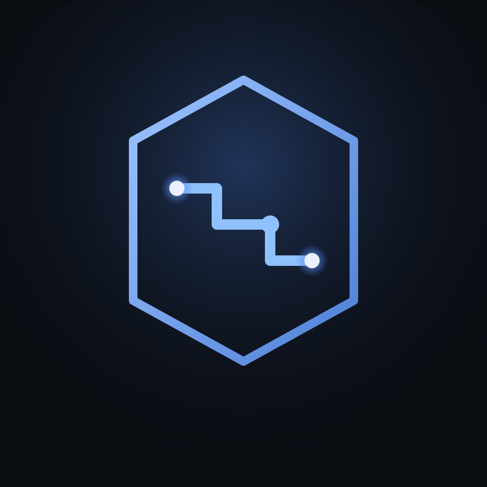

<p align="center">
  
</p>

<p align="center">
  
  
  
  <a href="https://creampuffenjoyer.github.io/sol./"></a>
</p>

<p align="center">
  <a href="https://creampuffenjoyer.github.io/sol./"><b>Open the live desktop</b></a>
</p>

## About this project

I am Joseph Benjamin Sollestre, known online as s0L. I am a Computer Science graduate pursuing a career in purple teaming and AI/ML security, an active CTF competitor, and a full stack developer. Instead of shipping another template portfolio site, I built one that behaves like an actual Linux desktop. It boots through a fake GRUB screen, plays a real kernel boot log, drops you at a lock screen, and lands on a working desktop with a window manager, a file system, and a terminal you can actually type in.

Every "app" on the desktop doubles as a section of my resume. The terminal has real commands. The file manager has a real folder tree. The achievements window is a trophy case of the CTF competitions I have placed in. Nothing here is a static image pretending to be interactive.

## Live demo

The desktop is live at [creampuffenjoyer.github.io/sol.](https://creampuffenjoyer.github.io/sol./), served straight from this repo through GitHub Pages with no build step in between.

## Features

* A boot sequence with a GRUB menu, an animated kernel log, and a lock screen you unlock by typing anything
* A window manager with drag, resize, snap to edge, minimize, and maximize, all built from scratch
* A terminal with a real fake filesystem, pipes, tab completion, command history, and over twenty built in commands
* A file manager, text editor, browser, image viewer, music player, and a Burp Suite style recon panel
* A resume viewer that renders my actual resume in the browser, plus a button to open the original PDF
* An achievements window showing my CTF and competition record
* A visual project gallery with expandable cards for everything I have built
* A command palette (press Control K) for jumping straight to any app
* A handful of hidden things for anyone curious enough to poke around the filesystem

## Screenshots

<p align="center">
  
</p>
<p align="center">
  
  
</p>
<p align="center">
  
  
</p>

## Tech stack

React 18 and React DOM are loaded straight from a CDN, JSX is compiled in the browser with Babel Standalone, and everything is plain CSS with custom properties for theming. There is no bundler, no package.json, and no build step. Clone it, serve the folder, and it runs.

## Running it locally

```bash
git clone https://github.com/creampuffenjoyer/sol..git
cd sol.
python -m http.server 8000
```

Then open `http://localhost:8000` in a browser. That is the entire setup.

## Try the terminal

Open the Terminal app (it opens automatically on boot) and try a few of these.

```bash
help
about
projects
achievements
neofetch
sudo hire-me
```

There is more hiding in the filesystem if you go looking with `ls -a` and `cat`.

## Contact

<p align="left">
  
  I am always open to talking about security work, CTFs, or interesting projects.
</p>

* Email: josephbenjamin.sollestre@gmail.com
* GitHub: [github.com/creampuffenjoyer](https://github.com/creampuffenjoyer)
* TryHackMe: [tryhackme.com/p/fymn](https://tryhackme.com/p/fymn)

<p align="center">
  <sub>The quieter you become, the more you are able to hear.</sub>
</p>
